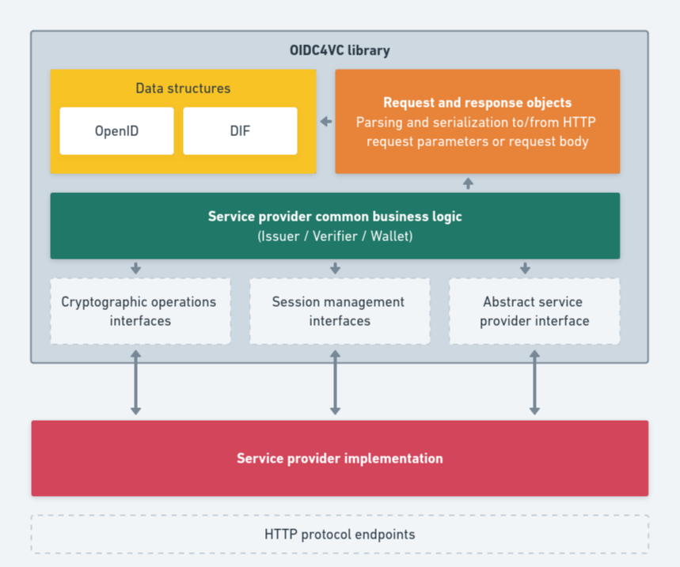

<div align="center">
 <h1>OpenID4VC - Kotlin multiplatform library</h1>
 <span>by </span><a href="https://walt.id">walt.id</a>
 <p>Multiplatform library implementing the data models and protocols of the <a href="https://openid.net/sg/openid4vc/">OpenID for Verifiable Credentials</a> specifications, including <a href="https://openid.net/specs/openid-4-verifiable-credential-issuance-1_0.html">OID4VCI</a>, <a href="https://openid.net/specs/openid-4-verifiable-presentations-1_0.html">OID4VP</a> and <a href="https://openid.net/specs/openid-connect-self-issued-v2-1_0.html">SIOPv2</a>.<p>

<a href="https://walt.id/community">

</a>
<a href="https://twitter.com/intent/follow?screen_name=walt_id">

</a>


</div>

## Installation
Add the openid4vc library as a dependency to your Kotlin or Java project.

### walt.id Repository

Add the Maven repository which hosts the walt.id libraries to your build.gradle file.

```kotlin
repositories {
    maven { url = uri("https://maven.waltid.dev/releases") }
} 
```

### Library Dependency

Adding the openid4vc library as dependency. Specify the version that coincides with the latest or required
snapshot for your project. [Latest releases](https://github.com/walt-id/waltid-identity/releases).

```kotlin
dependencies {
  implementation("id.walt:waltid-openid4vc:<version>")
}
```

Replace `version` with the version of the walt.id openid4vc library you want to use.
Note: As the openid4vc lib is part of the mono-repo walt.id identity, you need to use the version of
walt.id identity.

## Getting Started

### What it provides

* Request and response data objects
    * Parse and serialize to/from HTTP URI query parameters and/or HTTP form data or JSON data from request bodies
* Data structures defined by OpenID and DIF specifications
* Error handling
* Interfaces for state management and cryptographic operations
* Abstract base objects for issuer, verifier and wallet providers, implementing common business logic

### How to use it

To use it, depending on the kind of service provider you want to implement,

* Implement the abstract base class of the type of service provider you want to create (Issuer, Verifier or Wallet)
* Implement the interfaces for session management and cryptographic operations
* Implement a REST API providing the HTTP endpoints defined by the respective specification

### Architecture



## Examples

The following examples show how to use the library, with simple, minimal implementations of Issuer, Verifier and Wallet REST endpoints and
business logic, for processing the OpenID4VC protocols.

The examples are based on **JVM** and make use of the following libraries:
- [**ktor**](https://ktor.io/) for the HTTP server endpoints and client-side request
handling
- [**waltid-crypto**](https://github.com/walt-id/waltid-identity/tree/main/waltid-libraries/waltid-crypto) for cryptographic operations
- [**waltid-did**](https://github.com/walt-id/waltid-identity/tree/main/waltid-libraries/waltid-did) for DID-related operations 
- [**waltid-verifiable-credentials**](https://github.com/walt-id/waltid-identity/tree/main/waltid-libraries/waltid-verifiable-credentials) for credential and presentation handling

### Issuer

For the full demo issuer implementation, refer to `/src/jvmTest/kotlin/id/walt/oid4vc/CITestProvider.kt`

#### REST endpoints

For the OpenID4VCI issuance protocol, implement the following endpoints:

**Well-defined endpoints:**

These endpoints are well-defined, and need to be available under this exact path, relative to your issuer base URL:

* `GET /.well-known/openid-configuration`

* `GET /.well-known/openid-credential-issuer`

Returns the
issuer [provider metadata](https://openid.net/specs/openid-4-verifiable-credential-issuance-1_0.html#name-credential-issuer-metadata).

https://github.com/walt-id/waltid-identity/blob/main/waltid-libraries/waltid-openid4vc/src/jvmTest/kotlin/id/walt/oid4vc/CITestProvider.kt#L147-L152

**Other required endpoints**

These endpoints can have any path, according to your requirements or preferences, but need to be referenced in the provider metadata,
returned by the well-defined configuration endpoints listed above.


* `POST /par`

Endpoint to receive [pushed authorization requests](https://openid.net/specs/openid-4-verifiable-credential-issuance-1_0.html#name-pushed-authorization-reques), referenced in the provider metadata as `pushed_authorization_request_endpoint`, 
see [here](https://www.rfc-editor.org/rfc/rfc9126.html#name-authorization-server-metada).
  
  https://github.com/walt-id/waltid-identity/blob/main/waltid-libraries/waltid-openid4vc/src/jvmTest/kotlin/id/walt/oid4vc/CITestProvider.kt#L153-L161

* `GET /authorize`

[Authorization endpoint](https://openid.net/specs/openid-4-verifiable-credential-issuance-1_0.html#name-authorization-request), referenced
in provider metadata as `authorization_endpoint`, see [here](https://www.rfc-editor.org/rfc/rfc8414.html#section-2).

Not required for the pre-authorized issuance flow.

https://github.com/walt-id/waltid-identity/blob/main/waltid-libraries/waltid-openid4vc/src/jvmTest/kotlin/id/walt/oid4vc/CITestProvider.kt#L162-L206

* `POST /token`

[Token endpoint](https://openid.net/specs/openid-4-verifiable-credential-issuance-1_0.html#name-token-endpoint), referenced in provider
metadata as `token_endpoint`, see [here](https://www.rfc-editor.org/rfc/rfc8414.html#section-2).

https://github.com/walt-id/waltid-identity/blob/main/waltid-libraries/waltid-openid4vc/src/jvmTest/kotlin/id/walt/oid4vc/CITestProvider.kt#L207-L216

* `POST /credential`

[Credential endpoint](https://openid.net/specs/openid-4-verifiable-credential-issuance-1_0.html#name-credential-endpoint) to fetch the issued credential, after authorization flow is completed. Referenced in provider metadata as `credential_endpoint`, as
defined [here](https://openid.net/specs/openid-4-verifiable-credential-issuance-1_0.html#name-credential-issuer-metadata-p).

https://github.com/walt-id/waltid-identity/blob/main/waltid-libraries/waltid-openid4vc/src/jvmTest/kotlin/id/walt/oid4vc/CITestProvider.kt#L217-L229

* `POST /credential_deferred`

[Deferred credential endpoint](https://openid.net/specs/openid-4-verifiable-credential-issuance-1_0.html#name-deferred-credential-endpoin),
to fetch issued credential if issuance is deferred. Referenced in provider metadata as `deferred_credential_endpoint` (missing in spec).

https://github.com/walt-id/waltid-identity/blob/main/waltid-libraries/waltid-openid4vc/src/jvmTest/kotlin/id/walt/oid4vc/CITestProvider.kt#L230-L245

* `POST /batch_credential`

[Batch credential endpoint](https://openid.net/specs/openid-4-verifiable-credential-issuance-1_0.html#name-batch-credential-endpoint) to
fetch multiple issued credentials. Referenced in provider metadata as `batch_credential_endpoint`, as
defined [here](https://openid.net/specs/openid-4-verifiable-credential-issuance-1_0.html#name-credential-issuer-metadata-p).

https://github.com/walt-id/waltid-identity/blob/main/waltid-libraries/waltid-openid4vc/src/jvmTest/kotlin/id/walt/oid4vc/CITestProvider.kt#L246-L258

#### Business logic

For the business logic, implement the abstract issuance provider
in `src/commonMain/kotlin/id/walt/oid4vc/providers/OpenIDCredentialIssuer.kt`, providing session and cache management, as well, as
cryptographic operations for issuing credentials.

* **Configuration of issuance provider**

https://github.com/walt-id/waltid-identity/blob/main/waltid-libraries/waltid-openid4vc/src/jvmTest/kotlin/id/walt/oid4vc/CITestProvider.kt#L54-L71

* **Simple session management example**

Here we implement a simplistic in-memory session management:

https://github.com/walt-id/waltid-identity/blob/main/waltid-libraries/waltid-openid4vc/src/jvmTest/kotlin/id/walt/oid4vc/CITestProvider.kt#L73-L78

* **Crypto operations and credential issuance**

Token signing and credential issuance based on [**waltid-crypto**](https://github.com/walt-id/waltid-identity/tree/main/waltid-libraries/waltid-crypto), [**waltid-did**](https://github.com/walt-id/waltid-identity/tree/main/waltid-libraries/waltid-did) and [**waltid-verifiable-credentials**](https://github.com/walt-id/waltid-identity/tree/main/waltid-libraries/waltid-verifiable-credentials).

https://github.com/walt-id/waltid-identity/blob/main/waltid-libraries/waltid-openid4vc/src/jvmTest/kotlin/id/walt/oid4vc/CITestProvider.kt#L80-L139

### Verifier

For the full demo verifier implementation, refer to `/src/jvmTest/kotlin/id/walt/oid4vc/VPTestVerifier.kt`

#### REST endpoints

#### Business logic

### Wallet

#### REST endpoints

#### Business logic

## License

Licensed under the [Apache License, Version 2.0](https://github.com/walt-id/waltid-xyzkit/blob/master/LICENSE)

# Example flows:

## EBSI conformance test: Credential issuance:

```mermaid
sequenceDiagram
Issuer -->> Wallet: Issuance request (QR, or by request)
Wallet ->> Issuer: Resolve credential offer
Issuer -->> Wallet: Credential offer
Wallet ->> Issuer: fetch OpenID Credential Issuer metadata
Issuer -->> Wallet: Credential issuer metadata
Wallet ->> Wallet: Check if external authorization service (AS)
Wallet ->> AS: fetch OpenID provider metadata
AS -->> Wallet: OpenID provider metadata
Wallet ->> Wallet: resolve offered credential metainfo
Wallet ->> Wallet: Generate code verifier and code challenge
Wallet ->> AS: Authorization request, auth details and code challenge
AS -->> Wallet: Redirect to wallet with id_token request
Wallet ->> Wallet: Generate id_token
Wallet ->> AS: POST id_token response to redirect_uri
AS -->> Wallet: Redirect to wallet with authorzation code
Wallet ->> AS: POST token request with code and code verifier
AS -->> Wallet: Respond with access_token and c_nonce
loop Fetch offered credentials
Wallet ->> Wallet: generate DID proof
Wallet ->> Issuer: Fetch credentials from credential endpoint or batch-credential endpoint, with DID proof
Issuer -->> Wallet: Credential (and updated c_nonce)
end

```
